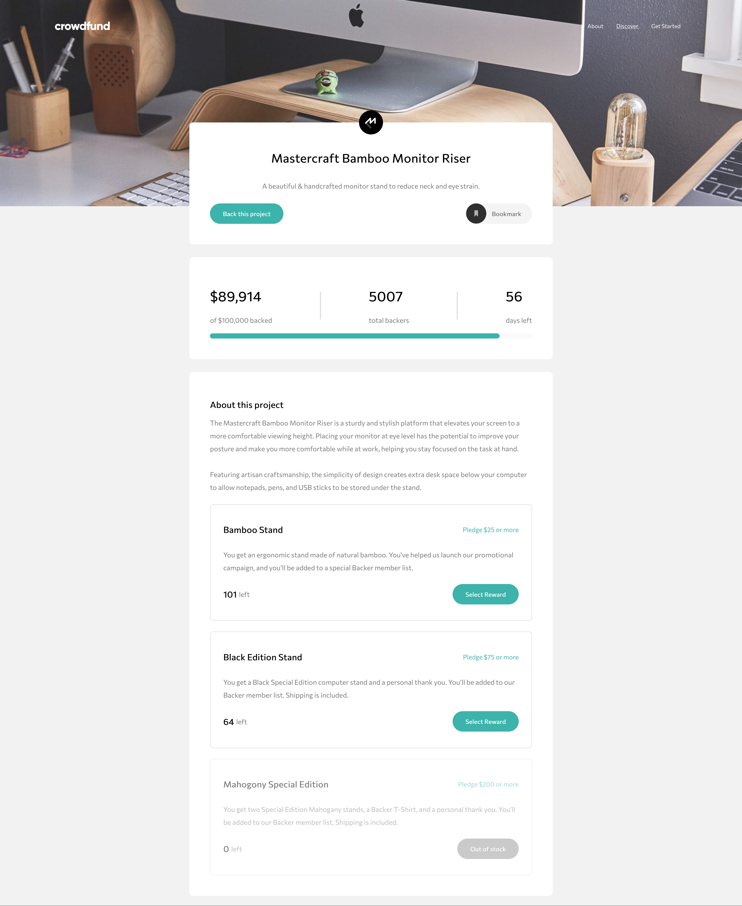
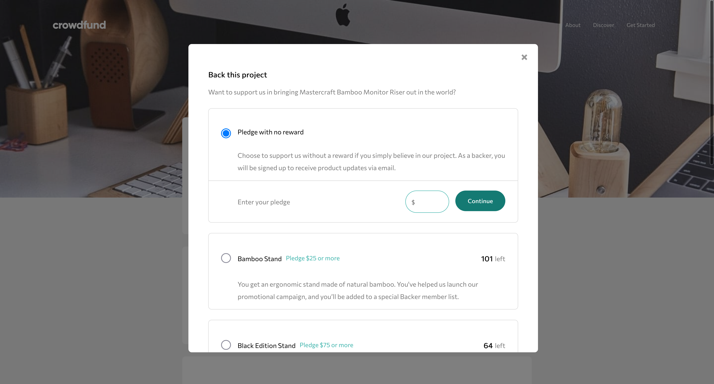
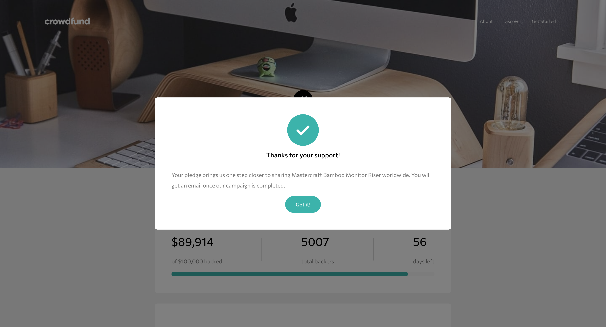
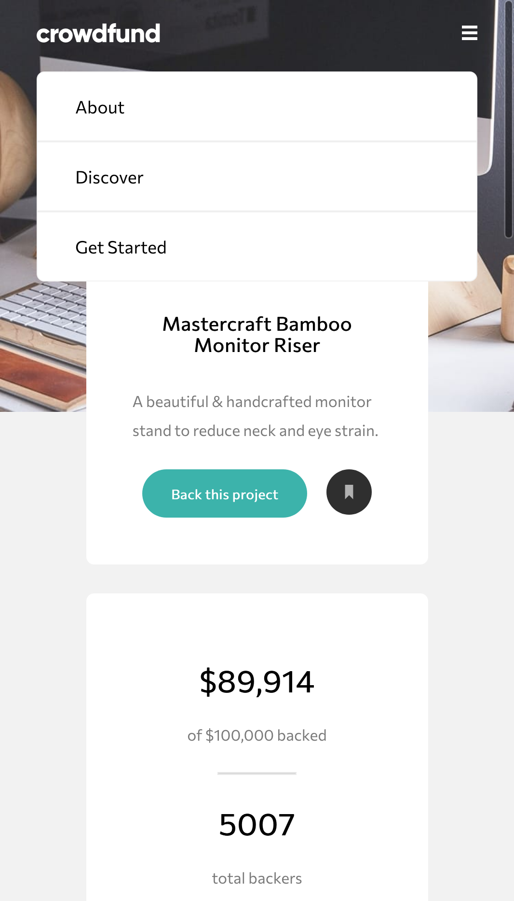
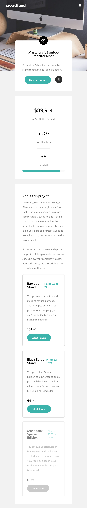
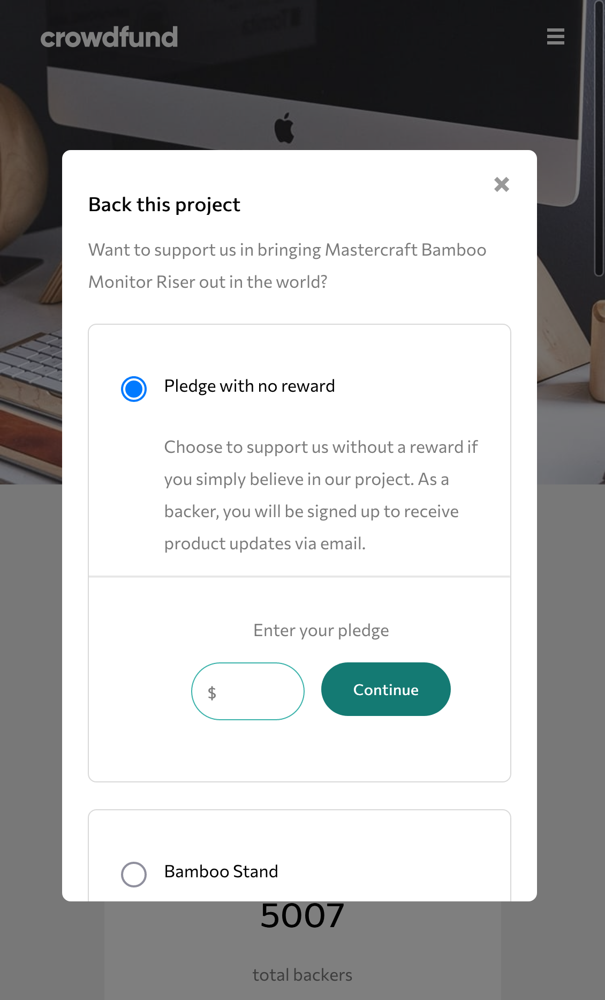
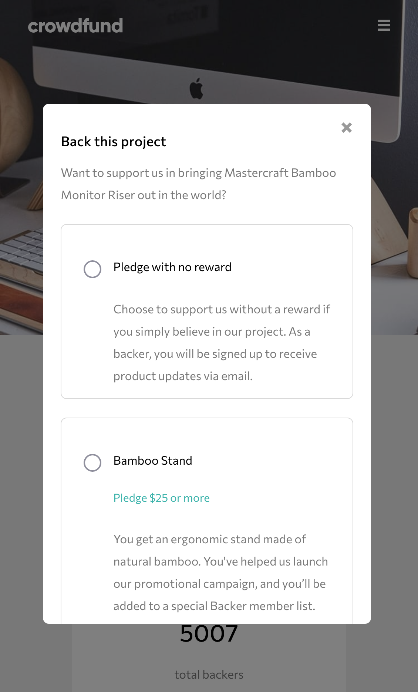
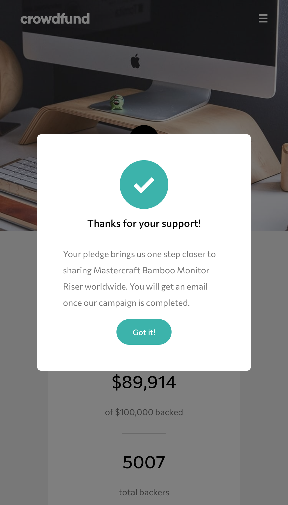

# Frontend Mentor - Crowdfunding product page solution

This is a solution to the [Crowdfunding product page challenge on Frontend Mentor](https://www.frontendmentor.io/challenges/crowdfunding-product-page-7uvcZe7ZR). Frontend Mentor challenges help you improve your coding skills by building realistic projects. 

## Table of contents

- [Overview](#overview)
  - [The challenge](#the-challenge)
  - [Screenshots](#screenshots)
  - [Links](#links)
- [My process](#my-process)
  - [Built with](#built-with)
  - [What I learned](#what-i-learned)
  - [Continued development](#continued-development)
- [Author](#author)

## Overview

### The challenge

Users should be able to:

- View the optimal layout depending on their device's screen size
- See hover states for interactive elements
- Make a selection of which pledge to make
- See an updated progress bar and total money raised based on their pledge total after confirming a pledge
- See the number of total backers increment by one after confirming a pledge
- Toggle whether or not the product is bookmarked

### Screenshots

### Links

- Solution URL: [https://github.com/landot/crowdfund-project](https://github.com/landot/crowdfund-project)
- Live Site URL: [https://timothyl-portfolio-crowdfund.netlify.app/](https://timothyl-portfolio-crowdfund.netlify.app/)

## My process

### Built with

- Semantic HTML5 markup
- CSS custom properties
- Flexbox
- Storybook
- [React](https://reactjs.org/) - JS library
- [Styled Components](https://styled-components.com/) - For styles

### What I learned

I learned how to not get overwhelmed with a large number of components on a page. To work through this prompt, I first created components in react and rendered them in storybook. That way I could do a quick check to make sure that the components were rendering correctly. Once I had the majority of the components created, I then started to work on putting the page together.

I got some more experience with absolute positioned elements and using media queries for updating the styling based on screen size.

### Continued development

Some weaknesses that I still need to improve on are: 
1. I need to think ahead on the mobile styling. On my next project, I plan on creating the layout in a mobile first implementation
2. I need to do a better job of using styled components in a more re-usable manner. I started some components but I ended up having to overwrite the css of them in different files. I can probably do this better in the future. 
3. I could have reduced the redundancy of certain aspects in the code. For example the pledge components on the main screen and the modal were pretty similar but I ended up writing them up as different components. 
4. Naming conventions could be improved. I ended up naming components too similarly and made mistakes by updating the incorrect file due to the Pledge component being similarly named with the ModalPledge component

## Author

- Website - [https://github.com/landot](https://github.com/landot)
- Frontend Mentor - [@landot](https://www.frontendmentor.io/profile/landot)

